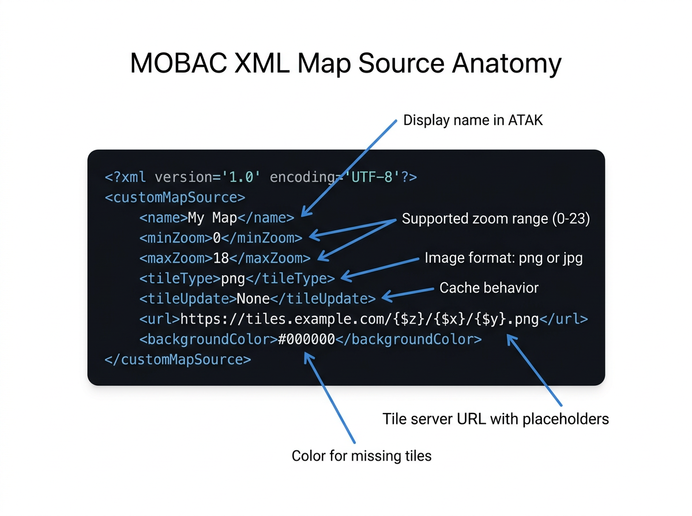

# Creating Custom Maps — Quickstart

This guide walks you through creating your first ATAK map source XML file
and submitting it to the repository. For the full element specification, see
the [MOBAC XML Reference](xml-reference.md).

## Create Your First Map Source

**1. Find a tile server URL.**
Public tile servers publish tiles in a `{z}/{x}/{y}` URL pattern. Common
sources include [OpenStreetMap](https://wiki.openstreetmap.org/wiki/Raster_tile_providers)
and government GIS portals (USGS, NOAA, state agencies).

**2. Create the XML file.**
Every `customMapSource` requires three elements: `name`, `url`, and `maxZoom`.
Adding `minZoom`, `tileType`, and `backgroundColor` is recommended.

**3. Complete example — OpenTopoMap:**

```xml
<?xml version="1.0" encoding="UTF-8"?>
<customMapSource>
    <name>OpenTopo - Opentopomap</name>
    <minZoom>1</minZoom>
    <maxZoom>17</maxZoom>
    <tileType>png</tileType>
    <url>https://a.tile.opentopomap.org/{$z}/{$x}/{$y}.png</url>
    <backgroundColor>#000000</backgroundColor>
</customMapSource>
```



**Key points:**
- `{$z}`, `{$x}`, `{$y}` are replaced with tile coordinates at runtime.
- `tileType` should match what the server returns (`png` or `jpg`).
- `maxZoom` must not exceed the server's actual max zoom level.

## Test It

1. Copy the XML file to your device at `atak/imagery/mobile/mapsources/`.
2. Open ATAK and look for your map name in the source list.
3. Pan and zoom to verify tiles load correctly.

See the [Install Guide](install-guide.md) for detailed installation
instructions and alternative methods.

## Submit to ATAK-Maps

1. Fork this repository and create a branch.
2. Add your XML file under the appropriate provider directory (e.g.,
   `opentopo/` for OpenTopoMap sources).
3. Use conventional commit format: `feat: add <map name>`.
4. Open a pull request.

See [CONTRIBUTING.md](../CONTRIBUTING.md) for full contribution guidelines.

## Next Steps

- [MOBAC XML Reference](xml-reference.md) — WMS sources, multi-layer
  composites, server load balancing, coordinate systems, and all element
  details.
- [Install Guide](install-guide.md) — All the ways to load map sources
  onto your device.
