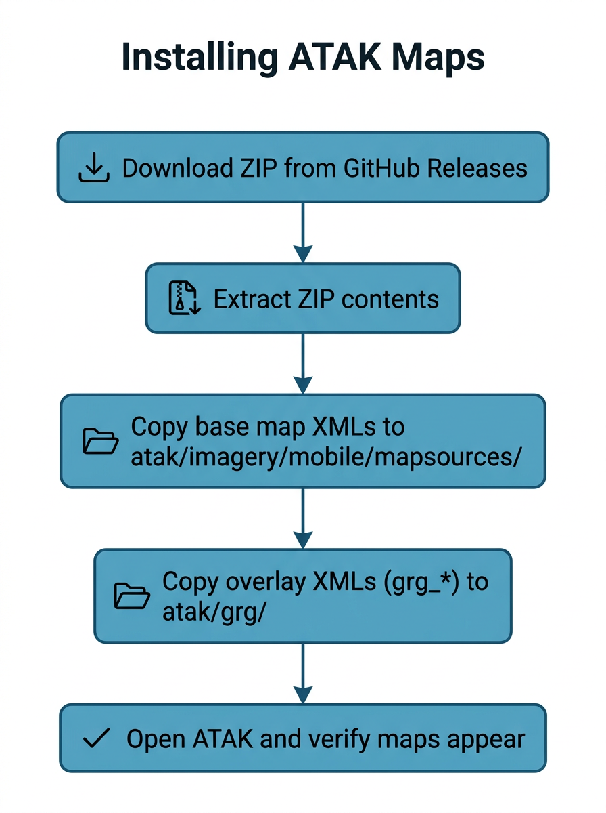
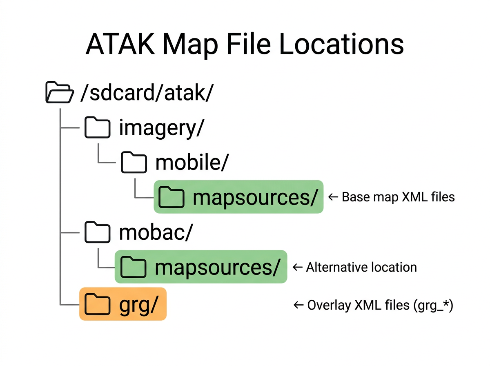

# Installing ATAK Maps

## Quick Start

1. Download `atak-maps-<version>.zip` from the [Releases page](https://github.com/joshuafuller/ATAK-Maps/releases).
2. Extract the ZIP on your device.
3. Copy all XML files to `<storage>/atak/imagery/mobile/mapsources/` on your device. Copy any files prefixed with `grg_` to `<storage>/atak/grg/` instead.
4. Open ATAK. New map sources appear in the map layer selector.



## What's in the Download

The release ZIP contains all available XML map source files, organized by provider:

- **Providers included:** Bing, Google, ESRI, USGS, OpenTopo, and others
- **Two types of files:**
  - **Base maps** -- satellite imagery, street maps, topographic maps
  - **Overlays** -- transparent layers (flood zones, trails, reference grids) with filenames starting with `grg_`
- Base maps and overlays install to different directories on your device

## Step-by-Step Installation



### Download

1. Go to the [Releases page](https://github.com/joshuafuller/ATAK-Maps/releases).
2. Download the latest `atak-maps-<version>.zip`.
3. Save it somewhere accessible on your Android device (e.g., the Downloads folder).

### Extract

1. Open your file manager and locate the downloaded ZIP.
2. Extract the contents. You will see folders organized by provider: `Bing/`, `Google/`, `ESRI/`, `GRG/`, `usgs/`, etc.

### Install Base Maps

1. Copy all `.xml` files **except** those starting with `grg_` to your device at:

   ```
   <storage>/atak/imagery/mobile/mapsources/
   ```

   `<storage>` is your device's internal storage root (typically `/sdcard` or `/storage/emulated/0`).

2. You can copy entire provider folders or pick individual files -- only `.xml` files matter.
3. The alternate directory `<storage>/atak/mobac/mapsources/` also works.

### Install Overlays

1. Copy files starting with `grg_` (found in the `GRG/` folder) to:

   ```
   <storage>/atak/grg/
   ```

2. These appear as overlay layers in ATAK, not base maps.

### Verify

1. Open ATAK.
2. Tap the map layer selector (layers icon).
3. New map sources should be listed. Select one and confirm tiles load.
4. For overlays, check the overlay manager -- `grg_` sources appear there.

ATAK uses file system monitoring, so new map files may appear without restarting the app. If they don't show up, restart ATAK.

## Installing Individual Maps

You do not have to install the entire collection. To add specific maps:

1. Browse the repository folders on [GitHub](https://github.com/joshuafuller/ATAK-Maps).
2. Download just the `.xml` files you want.
3. Place them in the same directories described above:
   - Base maps: `<storage>/atak/imagery/mobile/mapsources/`
   - Overlays (`grg_` prefix): `<storage>/atak/grg/`

## Offline Caching

ATAK automatically caches map tiles you view. To proactively cache an area for offline use:

1. In ATAK, open the map layer selector and choose the map source you want to cache.
2. Navigate to **Map Manager** (or long-press on the map layer).
3. Select **Download** and draw a region on the map.
4. Choose the zoom levels you need and start the download.
5. Cached tiles are stored in SQLite databases on your device and persist when you go offline.

Once cached, those tiles are available with no internet connection.

## Troubleshooting

### Maps don't appear in ATAK

- Confirm the file is in the correct directory: `atak/imagery/mobile/mapsources/` for base maps, `atak/grg/` for overlays.
- Confirm the file has a `.xml` extension (not `.txt` or something else).
- Restart ATAK.
- Check ATAK logs (Settings > Show Log) for errors loading map sources.

### Tiles show as black or blank

- The map server may be down or blocking requests.
- Check your internet connection.
- Some sources (notably OpenStreetMap) may restrict access from ATAK. These files are included for reference but may not always work.

### Wrong directory

Common mistakes:

| File type | Correct directory | Common mistake |
|-----------|-------------------|----------------|
| Base maps (`.xml`) | `atak/imagery/mobile/mapsources/` | `atak/imagery/` (parent dir -- won't be scanned for MOBAC files) |
| Overlays (`grg_*.xml`) | `atak/grg/` | `atak/imagery/` or `atak/imagery/mobile/mapsources/` |

### Accepted file extensions

ATAK recognizes these MOBAC file types:

| Extension | Description |
|-----------|-------------|
| `.xml` | Standard map source (this is what ATAK-Maps provides) |
| `.xmle` | Encrypted XML map source |
| `.bsh` | BeanShell scripted map source |
